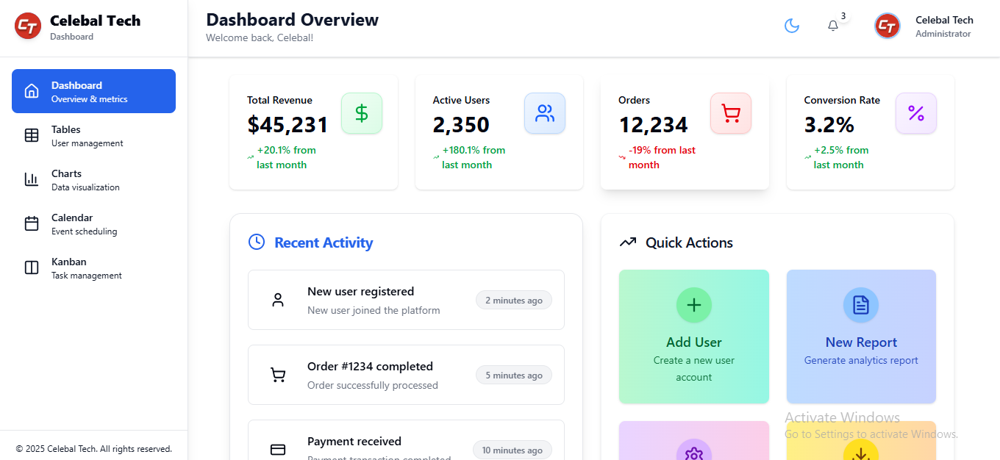
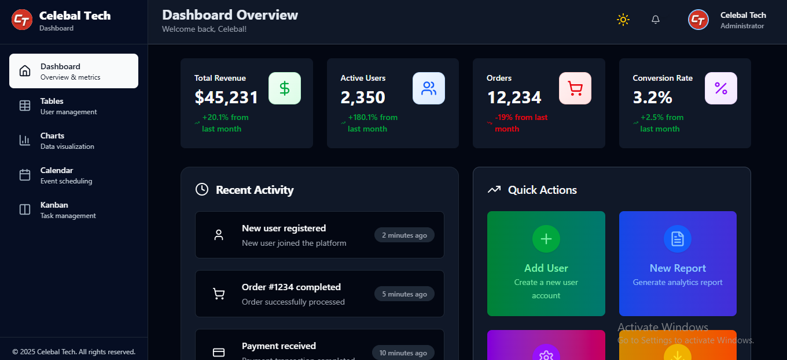
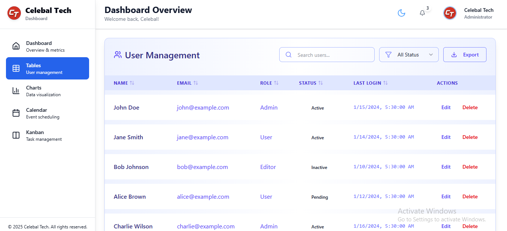
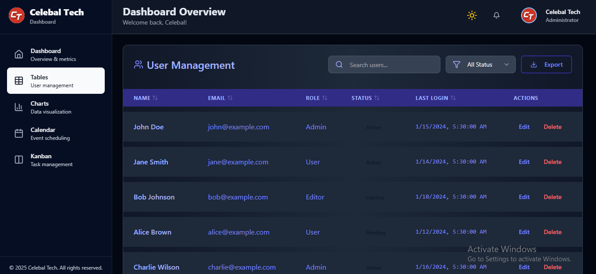
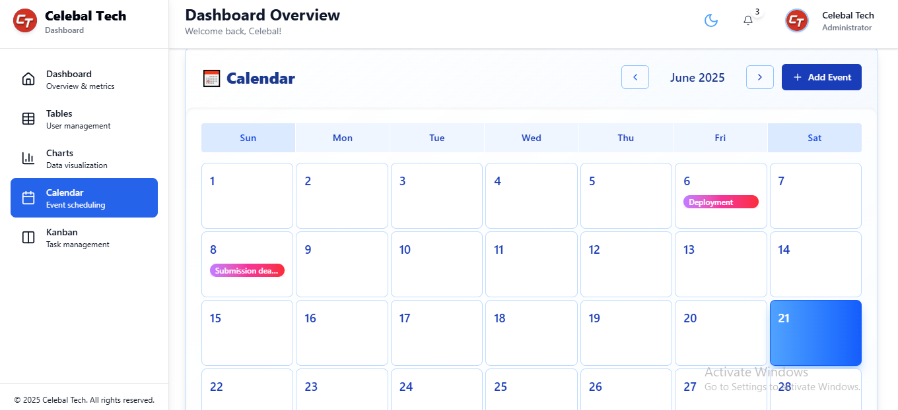
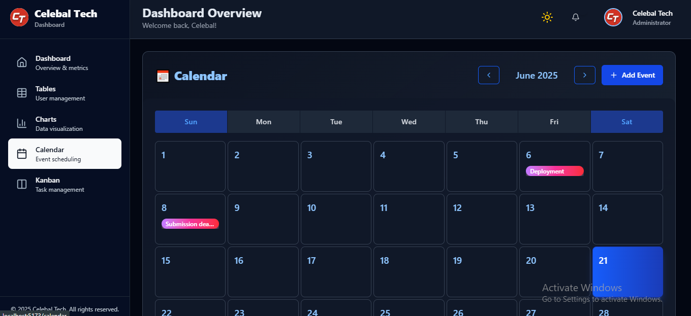
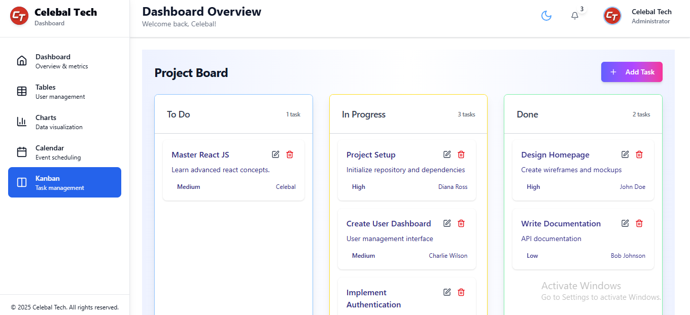
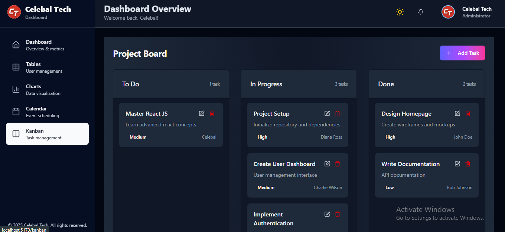
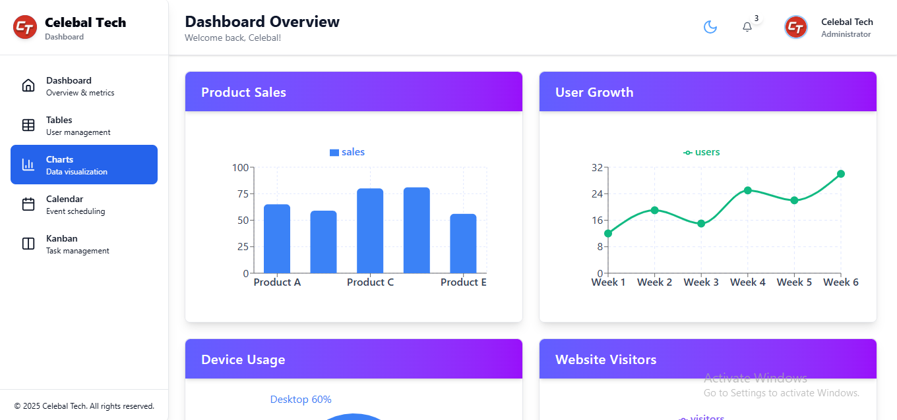
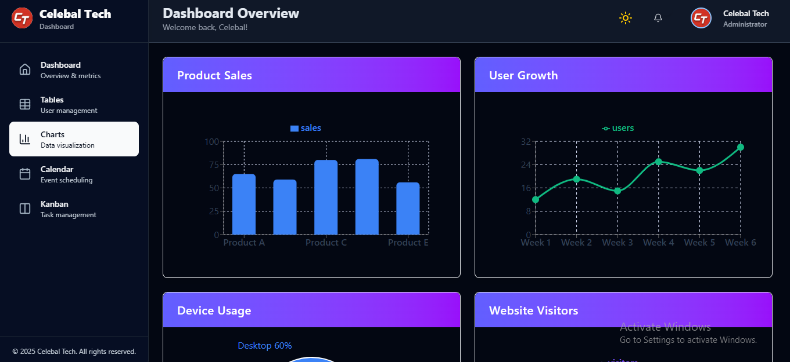

# 🚀 React Admin Dashboard

A modern, responsive, and feature-rich admin dashboard built using **React.js**. Designed for excellent UX and flexibility, this dashboard includes theme customization, integrated calendar, analytics, and a powerful Kanban board.

---

## ✨ Features

- 🎨 **Customizable Themes** – Light/Dark mode toggle with dynamic styling
- 📅 **Integrated Calendar** – Add, view, and manage events in a clean UI
- 📊 **Analytics Dashboard** – Visual cards and charts for key metrics
- 🗂️ **Kanban Board** – Drag & drop task management with column-based workflow
- 📱 **Responsive Design** – Optimized for all screen sizes
- 🔧 **Modular Components** – Easy to extend and maintain

---

## 🛠️ Tech Stack

- **Frontend**: React.js, React Router DOM
- **UI**: Tailwind CSS
- **State Management**: useState
- **Icons**:Lucide react library
- **Calendar**: Custom implementation
- **Charts**: Recharts 

---

## 📸 Screenshots

| Feature        | Light Mode                              | Dark Mode                               |
|----------------|------------------------------------------|------------------------------------------|
| **Dashboard**   |       |       |
| **Table**       |               |               |
| **Calendar**    |         |         |
| **Kanban**      |             |             |
| **Charts**      |             |             |

---

## 🚀 Getting Started & 📦 Installation

Quickly set up and run the **React Admin Dashboard** on your local machine.

1️⃣ Clone the repository
git clone https://github.com/manuj-chadha/dashboard.git

2️⃣ Navigate into the project directory
cd dashboard

3️⃣ Install all dependencies
npm install

